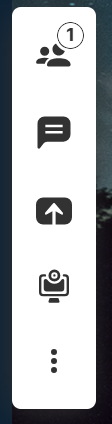
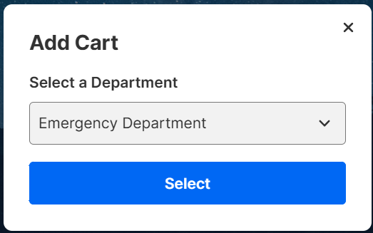
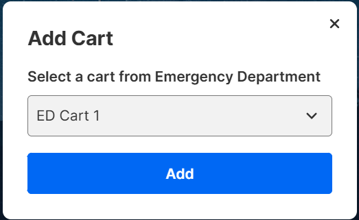
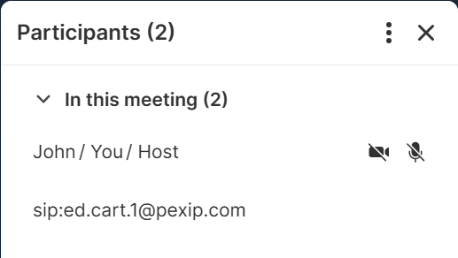

# Web App 3 Plugin: Select Cart

This plugin enables users to select specific carts from a department based on a
predefined configuration. Once a cart is selected, the plugin initiates a call
to the cart through a SIP (Session Initiation Protocol) call.

## How to use

An additional button is added to the toolbar for participants with the "host"
role. When the host clicks this button, a modal displays a list of configured
departments. If no departments are configured, or if the configuration file is
corrupted, an appropriate message is shown.

<div align='center'>



</div>

The toolbar contains a button to open the selection dialog

<div align='center'>



</div>

Select a department from provided list

<div align='center'>



</div>

Select a cart from provided list and trigger a dial out

<div align='center'>



</div>

A dial out to the selected cart will be imitated

## Configuration

To configure departments and carts for the plugin, use the JSON file
(`departments.json`) located in the public/config folder. This file organizes
departments and their associated carts, with each department having an ID and an
array of carts (each with a unique label and ID).

Each department in `departments.json` is structured as follows:

- **Department Name**: A descriptive name for the department (e.g., "Emergency
  Department"). This name is shown for selection in the dialog.
- **id**: A unique identifier for the department, such as `"1"` for the
  Emergency Department.
- **carts**: An array of cart objects, where each cart has:
  - **label**: A descriptive name for the cart (e.g., "ED Cart 1"). This name is shown for selection in the dialog.
  - **id**: A unique identifier for the cart, used for targeting specific carts in SIP calls.


```json
{
  "Emergency Department": {
    "id": "1",
    "carts": [
      {
        "label": "ED Cart 1",
        "id": "ed.cart.1"
      },
      {
        "label": "ED Cart 2",
        "id": "ed.cart.2"
      },
      {
        "label": "ED Cart 3",
        "id": "ed.cart.3"
      }
    ]
  },
  "Cardiovascular": {
    "id": "2",
    "carts": [
      {
        "label": "CV Cart 1",
        "id": "cv.cart.1"
      },
      {
        "label": "CV Cart 2",
        "id": "cv.cart.2"
      }
    ]
  }
}
```
### Adding or Modifying Departments and Carts

To add a new department or cart, update `departments.json` with new entries. For example, to add a new cart to the "Emergency Department," add a new object in the `carts` array for that department:

```json
{
  "label": "ED Cart 4",
  "id": "ed.cart.4"
}
```

## Run for development

- To be able to build the plugin, you need to comply with the following versions
  or higher:

  | NodeJS   | NPM     |
  | -------- | ------- |
  | v20.12.2 | v10.5.0 |

- Install all the dependencies:

```bash
$ npm i
```

- Run the dev environment:

```bash
$ npm start
```

The plugin will be served from https://localhost:5173 (visit that page and
accept the self-signed certificates), but you should access it thought the Web
App 3 URL. You have more information about how to configure your environment in
the
[Developer Portal: Setup guide for plugin developers](https://developer.pexip.com/docs/plugins/webapp-3/setup-guide-for-plugin-developers).

## Build for production

To create a package, you will need to first install all the dependencies:

```bash
$ npm i
```

And now to create the package itself:

```bash
$ npm run build
```

Congrats! Your package is ready and it will be available in the `dist` folder.
The next step is to create a Web App3 branding and copy `dist` into that
branding.

If you want to know more about how to deploy your plugin in Pexip Infinity,
check our [Developer Portal](https://developer.pexip.com).
